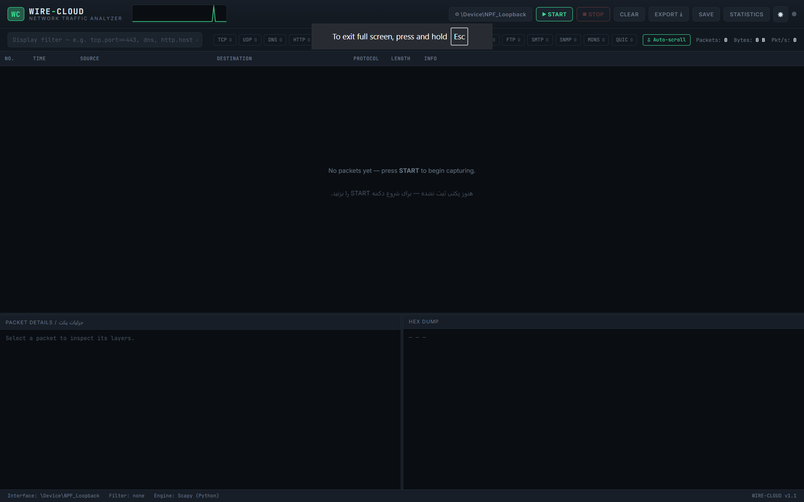

<h1 align="center">👁️ WIRE-CLOUD v2 👁️</h1>
<p align="center">
  <i>A Wireshark-style, web-based network traffic analyzer — runs locally on Windows & Linux.</i>
</p>
<p align="center">
  

### 📃 Overview :
```text
WIRE-CLOUD is a local, self-hosted packet capture and analysis tool with a dark, professional web dashboard.
It shows live traffic in a sortable packet list, a Wireshark-style display filter bar, a per-packet protocol
layer tree, a hex/ASCII dump, Follow-TCP-Stream reassembly, and protocol-hierarchy / conversation statistics —
the same mental model as Wireshark, reachable from any browser on `http://127.0.0.1:5000` with no desktop
GUI framework required.
```


##

### 🆚 Honesty check — how close is this to real Wireshark? :
```text
Wireshark is ~25 years of engineering with thousands of protocol dissectors, a Lua plugin API, and capture
support for dozens of link types (USB, Bluetooth, CAN bus, ...). No single project — this one included — can
literally replicate that in full, and this README won't pretend otherwise.

What WIRE-CLOUD DOES now cover, at a genuinely professional level:
  - A real Wireshark-style display filter language (not just substring search)
  - Deep dissection for the protocols people actually debug day to day: HTTP, DNS, TLS (SNI/handshake type),
    plus recognition of DHCP, NTP, SSH, FTP, SMTP, SNMP, mDNS and a QUIC heuristic
  - Follow TCP Stream, Protocol Hierarchy, and Conversations — the three "Statistics" views analysts reach
    for constantly
  - Standard .pcap export/import compatible with real Wireshark, for when you need its full dissector set

What it does NOT try to do: replace Wireshark's protocol coverage of the long tail (SCTP, dozens of
industrial/telecom protocols, etc.), non-Ethernet capture types, or TShark-style scripting. For anything
beyond this tool's scope, open the exported .pcap in real Wireshark.
```


##

### ⚡ Features :
```text
  - Startup capture setup — a modal asks you to pick the interface and an optional BPF filter (with quick
    presets: TCP/UDP/Web/DNS/ICMP) right when the app opens, before anything else happens
  - Light / dark theme toggle (☀ / ☾ button in the header), remembered between visits
  - Live packet capture over any local interface, with BPF filter syntax (`tcp port 443`, `udp`, `host 8.8.8.8`)
    — the BPF filter is now validated up-front, so a typo is reported immediately instead of only after
    the capture thread has already started
  - Real-time packet list pushed over WebSocket, batched every ~120 ms for smooth scrolling even at high
    packet rates
  - NEW — Wireshark-style display filter bar: `tcp.port==443`, `ip.addr==8.8.8.8`, `http.host contains
    "example"`, `dns.qry.name contains "google"`, `tls.sni contains "cloudflare"`, `not arp and tcp`,
    `tcp and (port==80 or port==443)`, parentheses/and/or/not all supported. The exact same grammar runs
    both live (client-side, on the streaming table) and against the buffered history (`/api/packets`), so
    filtering behaves identically everywhere. Anything that fails to parse degrades gracefully to a plain
    substring search instead of erroring out.
  - NEW — deeper protocol dissection: HTTP request method/path/Host and response status line; DNS query
    name/type and query-vs-response; TLS ClientHello SNI + handshake message type (Client Hello, Server
    Hello, Certificate, ...) extracted from the raw record without needing scapy's heavyweight TLS stack;
    plus recognition of DHCP, NTP, SSH, FTP, SMTP, SNMP, mDNS, and a QUIC heuristic (long-header UDP/443)
  - Protocol-coded rows (TCP / UDP / DNS / HTTP / TLS / ICMP / ARP / IPv6 / DHCP / NTP / SSH / FTP / SMTP /
    SNMP / MDNS / QUIC) with quick filter chips that show a live per-protocol count
  - Row tooltips surface the extracted metadata (HTTP Host, DNS query name, TLS SNI) at a glance
  - New packets briefly flash so you can track live traffic without losing your place
  - Auto-scroll toggle — pause auto-scroll to inspect packets without the list jumping around
  - Click any packet → full layer-by-layer detail tree + hex/ASCII dump, resizable panes
  - NEW — Follow TCP Stream: click any TCP/HTTP/TLS/SSH/FTP/SMTP row, then "FOLLOW TCP STREAM" to see the
    reassembled client ⇄ server conversation, color-coded by direction — the same workflow as Wireshark's
    Follow → TCP Stream
  - NEW — Statistics panel: Protocol Hierarchy (nested Ether/IP/TCP/HTTP-style counts with packet/byte
    totals, live-updating) and Conversations (endpoint-pair traffic totals with protocol tags) — mirrors
    Wireshark's Statistics → Protocol Hierarchy / Conversations
  - Live "pulse" throughput graph in the header
  - Export the current capture buffer to a standard `.pcap` file (openable in real Wireshark)
  - "Save session" → persists a `.pcap` + JSON summary that the PHP dashboard can list and let you re-download
  - Optional C++ helper for lower-overhead raw capture (`cpp/raw_capture.cpp`)
```

##

### 🐛 Bugs fixed in this pass :
```text
  - Capture loop called sniff() once outside the restart loop and then again identically inside it,
    duplicating the first 1-second poll on every capture start. Simplified to a single loop.
  - Packet detail lookup compared pkt.pcap_meta_id without a safe getattr, which could throw on any raw
    packet that hadn't been tagged yet; now uses getattr(..., None) defensively.
  - BPF filter errors only ever surfaced asynchronously (after the capture thread had already started and
    the frontend received a capture_error event). Bad filters are now validated synchronously in
    /api/capture/start, while genuine environment issues (libpcap/Npcap missing, "no such device") are
    correctly NOT reported as filter syntax errors.
  - DNS question-name extraction relied on dns.qdcount, which is a lazily-computed scapy field that stays
    None until the packet is actually serialized — it silently produced an empty query name for every live
    DNS packet. Fixed to check the qd record list directly.
```

##

### 🔎 Project structure :

```
wire-cloud/
├── backend/
│   ├── app.py                # Flask + Socket.IO server (REST + WebSocket API)
│   ├── capture_engine.py     # Scapy-based cross-platform sniffer + protocol dissection
│   ├── filters.py            # Wireshark-style display filter tokenizer/parser/evaluator
│   └── requirements.txt
├── frontend/
│   ├── templates/index.html  # Main dashboard page
│   └── static/
│       ├── css/style.css     # Dark professional theme
│       └── js/
│           ├── filters.js    # Client-side mirror of the display filter grammar
│           └── app.js        # Live table, filters, hex view, stats, follow-stream, splitters
├── php/
│   ├── index.php             # Session-history reporting dashboard
│   ├── download.php          # Safe .pcap download endpoint
│   └── report.css
├── cpp/
│   ├── raw_capture.cpp       # Optional high-performance libpcap sniffer
│   └── Makefile
├── captures/                 # Saved sessions land here (.pcap + .json)
├── run_linux.sh              # One-command launcher for Linux
├── run_windows.bat           # One-command launcher for Windows
└── README.md
```

##

### ⚙️ Tech stack :

| Layer / لایه | Technology / فناوری | Role / نقش |
|---|---|---|
| Capture engine / موتور ضبط | **Python** + Scapy | Cross-platform live sniffing, protocol parsing, pcap export |
| Display filters / فیلتر نمایشی | **Python** (`filters.py`) + **JS** (`filters.js`) | Wireshark-style filter language, shared grammar on both server and client |
| Web backend / بک‌اند وب | **Python** (Flask + Flask-SocketIO) | REST API + real-time WebSocket packet stream |
| Web frontend / فرانت‌اند وب | **HTML5 / CSS3 / JavaScript** | Wireshark-like dashboard, live oscilloscope, hex viewer, stream/statistics modals |
| Reporting module / ماژول گزارش‌گیری | **PHP** | Read-only dashboard listing saved capture sessions (`php/`) |
| High-performance capture (optional) / ضبط پرسرعت (اختیاری) | **C++** + libpcap | Standalone raw-socket sniffer emitting JSON lines (`cpp/`) |

##

### 🧪 Display filter syntax cheat-sheet :

```text
  dns                                    bare protocol name
  tcp and not http                       boolean combination (and/or/not, && / || also accepted)
  ip.addr == 8.8.8.8                     matches src OR dst
  ip.src == 10.0.0.5 / ip.dst != ...     one-sided address match
  tcp.port == 443 / udp.port == 53       matches sport OR dport
  tcp.srcport / tcp.dstport / udp.srcport / udp.dstport
  frame.len > 500 / len < 100            numeric comparison: ==, !=, >, <, >=, <=
  http.host contains "example"           substring match (case-insensitive)
  http.uri == "/login"
  dns.qry.name contains "google"
  tls.sni contains "cloudflare"
  not arp                                negation (! also works)
  tcp and (port == 80 or port == 443)    parentheses
  192.168.1.10                           bare IP literal -> matches src or dst
```


##

### 🌐 Requirements :

- Python 3.9+
- **Linux:** `libpcap` (usually pre-installed; if not: `sudo apt install libpcap-dev`) and root privileges to capture.
- **Windows:** [Npcap](https://npcap.com) installed with **"Install Npcap in WinPcap API-compatible Mode"** checked, and Administrator privileges to capture.
- (Optional) PHP 8+ if you want to run the reporting dashboard.
- (Optional) `g++` and libpcap headers if you want to build the C++ helper.

##

### 💡 Installation & run — Linux :
### Automatic :
```bash
git clone https://github.com/The-Lxx-CLoUD/WIRE-CLoUDv2
```
```bash
cd WIRE-CLoUDv2
```
```bash
chmod +x run_linux.sh
```
```bash
sudo ./run_linux.sh
```
### Manually :
```text
1 - python3 -m venv venv
2 - source venv/bin/activate
3 - pip install -r backend/requirements.txt
4 - sudo venv/bin/python backend/app.py
```
##

### 💡 Installation & run — Windows :

### Automatic :
```text
1 - open WIRE-CLoUD folder.
2 - Right-click `run_windows.bat` → Run as administrator.
3 - Your browser opens automatically at **http://127.0.0.1:5000**.
```
### Manually :
```text
1 - Install Python 3.9+👉(https://python.org)👈 and make sure "Add Python to PATH" is checked during setup.
2 - Install Npcap👉(https://npcap.com)👈 — during setup, check "Install Npcap in WinPcap API-compatible Mode".
3 - Right-click `run_windows.bat` → Run as administrator.
    The script creates a virtual environment, installs dependencies, and launches the server.
4 - Your browser opens automatically at **http://127.0.0.1:5000**.
```
##

### 🔰 Using the dashboard :

1. On first load, a **setup modal** appears — pick a network interface and, optionally, a BPF filter (or use a preset chip like "Web (80/443)" or "DNS"). Click **Start capturing** to jump straight into a live capture, or **Decide later** to just save the choice without starting yet.
2. Packets stream into the table live. Click **STOP** to pause, or the **⚙ settings** button in the header to reopen the setup modal and change interface/filter (capture must be stopped first).
3. Use the **display filter** bar for Wireshark-style expressions (see the cheat-sheet above) or the protocol chips (each shows a live count) to narrow what's shown — this only affects the view, not what's captured.
4. Click any row to see its full protocol layer tree and hex/ASCII dump below. For TCP-based protocols (TCP/HTTP/TLS/SSH/FTP/SMTP), a **FOLLOW TCP STREAM** button appears above the detail tree — click it to see the reassembled conversation.
5. Click **STATISTICS** in the header for the Protocol Hierarchy and Conversations views — both update live while the panel is open.
6. Toggle **Auto-scroll** off if you want to inspect older packets without the list jumping to the newest one.
7. Use the **☀ / ☾** button in the header to switch between light and dark themes — your choice is remembered.
8. Use **EXPORT** to download a `.pcap` you can open in real Wireshark, or **SAVE** to archive the session with a JSON summary for the PHP reports dashboard.
9. Use **CLEAR** to empty the in-memory buffer.

##

### ⚠️ PHP reporting dashboard (optional) :

Sessions saved from the main app (`SAVE SESSION` button) land in `captures/`. To browse them:
```bash
php -S 127.0.0.1:8080 -t php
```
Open **http://127.0.0.1:8080**. This dashboard is read-only and does not itself capture traffic — it only lists and lets you re-download previously saved `.pcap` sessions and their protocol breakdown.

##

### 🔥 Optional C++ high-performance capture module :

For advanced users who want a lower-overhead capture process outside Python, `cpp/raw_capture.cpp` is a standalone libpcap sniffer that prints one JSON object per packet to stdout. It is **not required** — the default Python/Scapy engine is sufficient for normal use.
```bash
cd cpp
```
```bash
make
```
```bash
sudo ./raw_capture eth0 "tcp or udp"
```

##

### 🖥️ Troubleshooting :

| Problem / مشکل | Fix / راه‌حل |
|---|---|
| **EN** "Permission denied" when starting capture | Run with `sudo` (Linux) or as Administrator (Windows). |
| **FA** خطای "Permission denied" هنگام شروع ضبط | برنامه را با `sudo` (لینوکس) یا با دسترسی Administrator (ویندوز) اجرا کنید. |
| **EN** No interfaces listed | Linux: check `ip link`; Windows: confirm Npcap is installed correctly. |
| **FA** هیچ کارت شبکه‌ای نمایش داده نمی‌شود | لینوکس: با `ip link` بررسی کنید؛ ویندوز: از نصب صحیح Npcap مطمئن شوید. |
| **EN** "Invalid capture filter" when starting | Check your BPF syntax (e.g. `tcp port 443`, not `tcp:443`) — this is now validated before capture starts. |
| **FA** خطای "Invalid capture filter" هنگام شروع | سینتکس BPF را بررسی کنید (مثلاً `tcp port 443` نه `tcp:443`) — این مورد اکنون پیش از شروع ضبط بررسی می‌شود. |
| **EN** Display filter shows nothing / everything | If your expression doesn't parse, it silently falls back to plain substring search — double-check field names against the cheat-sheet above. |
| **FA** فیلتر نمایشی چیزی نشان نمی‌دهد یا همه‌چیز را نشان می‌دهد | اگر عبارت شما قابل تفسیر نباشد، به جست‌وجوی متنی ساده تبدیل می‌شود — نام فیلدها را با جدول بالا بررسی کنید. |
| **EN** Port 5000 already in use | Edit the last line of `backend/app.py` and change `port=5000`. |
| **FA** پورت ۵۰۰۰ قبلاً استفاده شده | خط آخر فایل `backend/app.py` را ویرایش کرده و `port=5000` را تغییر دهید. |
| **EN** Browser doesn't auto-open | Manually visit `http://127.0.0.1:5000`. |
| **FA** مرورگر به‌صورت خودکار باز نمی‌شود | به‌صورت دستی آدرس `http://127.0.0.1:5000` را باز کنید. |

##

### 👤 Author :

- GitHub : [@TheLxxCLoUD](https://github.com/The-Lxx-CLoUD)
- Telegram : [@lxxcloud](https://t.me/lxxcloud)

```text
For personal, educational, and authorized security-testing use. Use responsibly and only on networks you are permitted to monitor.
```

```text
For educational and authorized security testing purposes only.
Use this tool only on systems you own or have explicit permission to test.
The user bears full responsibility for ensuring lawful use.
The developer assumes no liability for any misuse or illegal activity associated with this tool.
```
